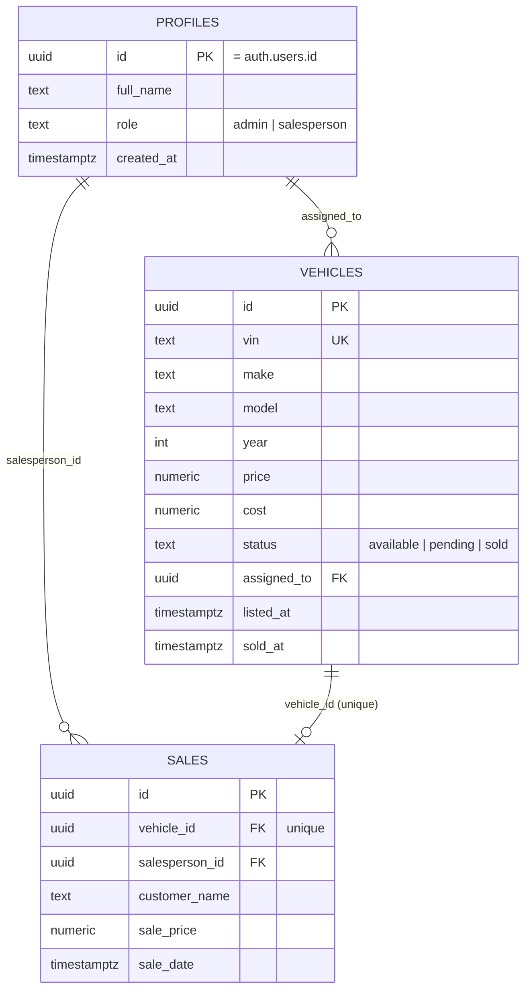

# Alba Cars — Dealership Dashboard

**Live demo:** https://assignment-2-dashboard-six.vercel.app
**Assignment:** Alba Cars take-home, Assignment 2 (Data Dashboard on a Backend Service)

A real inventory & sales dashboard for a car dealership: salespeople manage
the vehicles assigned to them, admins see everything, and two charts are
computed **inside the database**, not in the browser.

> **Status: verified live.** This has been run end-to-end against a real
> Supabase project — both migrations, the seed script, sign-in as both
> demo accounts, full CRUD, and the RLS boundary test below all actually
> executed and observed, not just reviewed. Two real bugs turned up doing
> that (a silently-skipped migration and a bad `RETURNING INTO` in the
> seed script) — see `BUILD_LOG.md` for exactly what broke and how it was
> caught, since that's more useful than pretending it was clean the first
> time.

## Why Supabase

Supabase is real Postgres, which means the schema is genuine SQL — tables,
foreign keys, and check constraints, not a loose document store — and Row
Level Security is a first-class Postgres feature there rather than a
bolted-on permissions layer. That matters twice here: the assignment
specifically wants a documented relational schema, and the analytics
feature (below) is implemented as real SQL views, which only makes sense
on top of a real relational database.

## Data model

Full DDL: [`supabase/migrations/0001_schema.sql`](./supabase/migrations/0001_schema.sql).
Two triggers do real work so the UI never has to remember to do it:
`handle_new_user` creates a `profiles` row the moment someone signs up, and
`mark_vehicle_sold` flips a vehicle to `status = 'sold'` the instant a
`sales` row is inserted for it — so those two facts can never disagree.

### Services used

- **Postgres tables**: `profiles`, `vehicles`, `sales` (no separate storage
  buckets or edge functions — this app didn't need file uploads).
- **Supabase Auth**: email/password, no external providers.
- **Database functions**: `handle_new_user`, `mark_vehicle_sold` (triggers),
  `is_admin` (RLS helper), `dashboard_summary` (KPI aggregation, see below).
- **Database views**: `monthly_revenue`, `inventory_aging`, `sales_by_make`.

## Advanced options implemented

### 1. Secure, isolated data (RLS)

Salespeople can only select/update/delete vehicles where
`assigned_to = auth.uid()`, and only see sales where
`salesperson_id = auth.uid()`. Admins (`profiles.role = 'admin'`) see and
manage everything. Full policies: [`supabase/migrations/0002_rls.sql`](./supabase/migrations/0002_rls.sql).

A few decisions worth calling out:

- `is_admin()` is a `security definer` function, not an inline subquery in
  every policy — this avoids infinite recursion (a policy on `profiles`
  that queries `profiles` to check the role would otherwise re-trigger
  itself) and keeps every table's policy readable.
- Sales are **insert-and-lock** for salespeople — they can create a sale
  for their own vehicle, but only an admin can update or delete one
  afterwards. A sale is a financial record; letting the person who made it
  quietly edit or delete it later isn't a real-world dealership workflow.
- The insert policy on `vehicles` checks `assigned_to = auth.uid()` **at
  the database level**, not just by hiding the field in the UI — a
  salesperson who edits the request to assign a new listing to someone
  else gets rejected by Postgres itself, regardless of what the client
  sends. That's the actual security boundary, not the form.

#### Verifying the security boundary actually holds

This was actually run against the live project, not just planned:

1. Signed in as `admin@albacars.demo` — Overview showed all 6 vehicles,
   AED 417,000 total revenue (both salespeople's sales combined).
2. Signed out, signed in as `salesperson@albacars.demo` — Overview showed
   **4 vehicles** (only the ones `assigned_to` her) and **AED 93,000**
   revenue (only her one sale), not the admin's numbers. `/vehicles` and
   `/sales` matched: 4 rows and 1 row respectively, with the admin's
   Nissan Patrol, Ford Explorer, and the Toyota Land Cruiser sale nowhere
   in her view.
3. This is what caught a real bug (see `BUILD_LOG.md`): the first time
   this test ran, the salesperson saw all 6 vehicles and the full
   revenue figure — identical to the admin's view. RLS was enabled in the
   source file but had never actually been applied to the live database
   (`relrowsecurity` was `false` on all three tables, zero policies
   existed). Re-running `0002_rls.sql` — and this time actually confirming
   the destructive-operation dialog rather than assuming the click landed
   — fixed it; re-running the test above confirmed the fix.

### 2. Server-computed analytics

The two dashboard charts are backed by real SQL views
(`supabase/migrations/0003_analytics_views.sql`), not client-side
aggregation of raw rows:

- `monthly_revenue` — revenue and gross profit per calendar month, joined
  against `vehicles.cost` so profit isn't just a client-side guess.
- `inventory_aging` — days-on-lot for every unsold vehicle, computed with
  `extract(day from now() - listed_at)` in the database.
- `dashboard_summary()` — a function returning the four KPI-card numbers
  in one round trip instead of four separate queries.

**The detail that actually matters here**: every view is created `with
(security_invoker = true)`. Without that, a view owned by the `postgres`
role would run with the owner's permissions, not the caller's — meaning a
naive analytics view would silently leak every dealership's full data past
RLS. `security_invoker = true` is what makes "the chart only shows what
you're allowed to see" actually true instead of just implied.

## Core requirements

- **Full CRUD**: add/edit/delete a vehicle, record a sale (`/vehicles`).
  Every mutation is a Server Action with `useTransition` for pending state
  and inline error messages — no silent failures.
- **Two real charts**: revenue-by-month and inventory-aging (Recharts),
  both backed by the views above.
- **Beautiful, fluid UI**: clean card/table layout, fade-in transitions,
  shimmer skeletons, empty states for "no vehicles yet" / "no sales yet".
- **Backend doing real work**: no local state or JSON file — every read is
  a live Supabase query, filtered by RLS.

## Setup from zero

1. Create a free project at [supabase.com](https://supabase.com).
2. In the SQL Editor, run the three migration files in order:
   `0001_schema.sql`, `0002_rls.sql`, `0003_analytics_views.sql`
   (from `supabase/migrations/`). **Confirm the "destructive operation"
   dialog Supabase shows for each one** — the SQL editor pops a
   confirmation modal for statements it flags as risky (which includes
   `alter table ... enable row level security` and most DDL), and
   dismissing it without clicking through means the statement silently
   never runs while the editor still shows the previous query's success
   message. This bit me for real — see `BUILD_LOG.md`.
3. In **Authentication → Users**, create two users:
   `admin@albacars.demo` and `salesperson@albacars.demo` (any password —
   note it down, you'll need it to log in).
4. Run `supabase/seed.sql` in the SQL Editor — it looks up those two users
   by email, promotes the first to `role = 'admin'`, and inserts demo
   vehicles and sales.
5. Copy `.env.local.example` to `.env.local` and fill in your project's
   URL and anon key (Project Settings → API — the new "publishable" key
   works fine in place of the legacy anon key).
6. `npm install && npm run dev`, then sign in with either demo account.

### A way in

Demo credentials (after step 3-4 above): `admin@albacars.demo` /
`salesperson@albacars.demo`, password `AlbaDemo2026!` for both in this
deployment. The seed script gives both accounts a realistic mix of
available, pending, and sold inventory so the charts aren't empty on
first login.

## API quirks / things worth knowing

- Supabase RLS **filters rows silently** — a blocked `select` returns an
  empty array, not a 403. A blocked `insert`/`update` either fails the
  `with check` clause (visible error) or, for `update`/`delete`, can
  silently affect 0 rows if the `using` clause excludes it. Don't mistake
  "nothing happened" for "nothing exists."
- `security_invoker` on views is a Postgres 15+ feature — if you're on an
  older Postgres version (shouldn't happen on a new Supabase project, but
  worth knowing), that clause will error and needs to be dropped, which
  would also mean re-checking the views for RLS leakage some other way.
- Next.js's static-generation pass will happily prerender an
  authenticated page at build time if nothing forces it dynamic — I hit
  this early (`/` was being built as static HTML), which is exactly wrong
  for a per-user dashboard. Fixed with `export const dynamic =
  "force-dynamic"` on the dashboard layout. Worth checking for in any
  Next.js + Supabase Auth app, not just this one.

## Tech stack

- **Next.js 16** (App Router, Server Actions, Server Components) — Server
  Actions do every mutation, keeping the Supabase service logic off the
  client entirely.
- **Supabase** (`@supabase/ssr`, `@supabase/supabase-js`) for Postgres,
  Auth, and RLS.
- **Recharts** for the two charts — lightweight, composable, no heavier
  charting framework needed for two chart types.
- **Tailwind CSS v4** for styling.

## How I tested this

- `npm run build` and `npm run lint`: clean, zero errors, zero warnings.
- Provisioned a real Supabase project, ran all three migrations and the
  seed script, and clicked through the actual app against live data.
- Signed in as `admin@albacars.demo`: Overview KPIs, revenue-by-month
  chart, and inventory-aging chart all rendered real seeded numbers.
  Marked a vehicle sold end-to-end (Inventory → "Mark sold" → customer
  name + price → confirm), and the new sale immediately appeared on
  `/sales` and updated the Overview revenue figure.
- Signed in as `salesperson@albacars.demo` and confirmed the RLS boundary
  holds — see "Verifying the security boundary" above.
- Confirmed the "Supabase not configured" fallback renders correctly with
  no environment variables set.
- Along the way, found and fixed two real bugs that only a live run could
  have caught (a migration that silently never applied, and a broken
  `RETURNING INTO` in the seed script) — full detail in `BUILD_LOG.md`.
